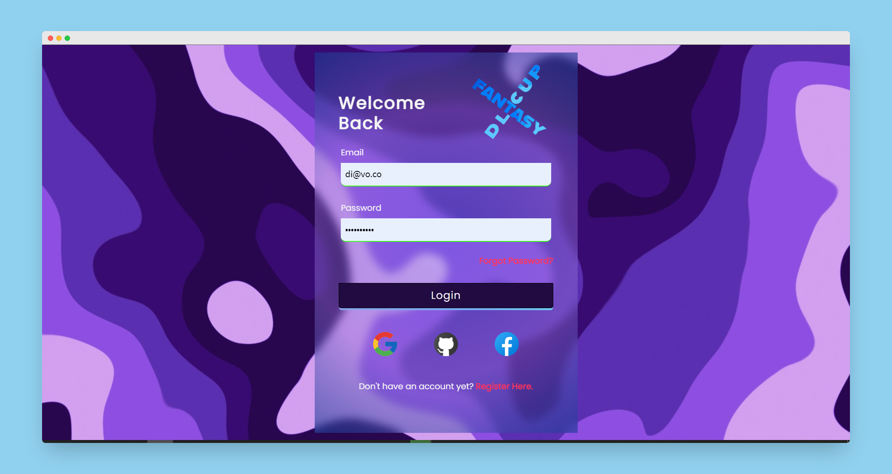
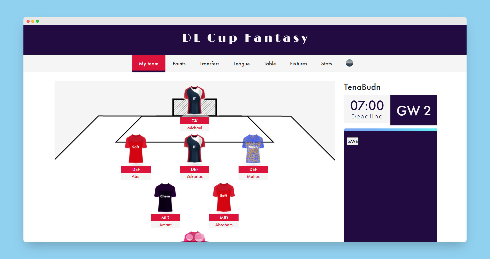
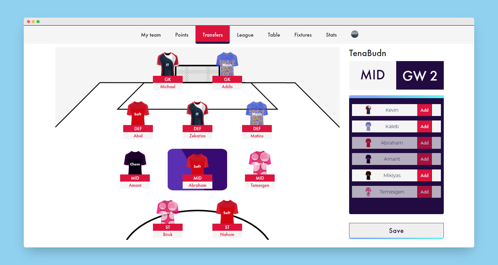

# FantasyDL





A fantasy football web application for a league tournament for the classes of 22' and 23' at Addis Ababa Institute of Technology. 

<br>

To use our flask server add a .env file containing the following information

```
FLASK_APP=main.py
JWT_SECRET_KEY='your_secret'
SQLALCHEMY_TRACK_MODIFICATIONS=False
SQLALCHEMY_DATABASE_URI='your_db_url'
````
<br>

### Live at https://fantasydl.netlify.app/
